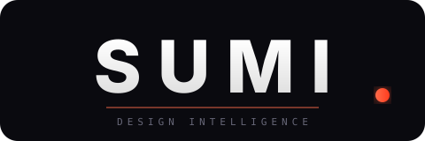

<p align="center">
  
</p>

<p align="center">
  <strong>UX/UI intelligence for Claude Code.</strong><br />
  42 skills. 33 commands. 165 reference docs. One plugin.
</p>

<p align="center">
  <a href="#install">Install</a> ·
  <a href="#commands">Commands</a> ·
  <a href="#skills">Skills</a> ·
  <a href="#how-it-works">How it works</a>
</p>

---

Sumi embeds the entire product design lifecycle into your terminal. Research, wireframe, build, audit, ship — every step grounded in NNG methodology, cognitive science, and 20+ years of case studies.

You type a command. Sumi loads the relevant design intelligence. Output is copy-paste ready.

```
/04-taste fintech       → color, type, spacing, tokens, 5 reference apps
/18-screen dashboard    → component hierarchy, 7 states, responsive, ARIA
/23-roast               → 10-dimension critique, prioritized fixes
/19-ship modal          → React/SwiftUI/CSS, full ARIA, keyboard nav
```

<br />

## The Journey

Seven phases. Thirty steps. Each command suggests the next.

```
GROUND       01 → 02                                                know your problem
DISCOVER     03 → 04 → 05 → 06 → 07                               know your market
SHAPE        08 → 09 → 10 → 11                                     explore your solution
AUDIT        12 → 13 → 14 → 15 → 16                                find your problems
BUILD        17 → 18 → 19 → 20 → 21                                ship your product
VALIDATE     22 → 23 → 24 → 25                                     prove it works
LAUNCH       26 → 27 → 28 → 29 → 30                                ship and grow
```

Run `/guide` to see where you are. `/next` to auto-advance. `/status` for progress.

<br />

## Commands

| # | Command | Purpose |
|---|---------|---------|
| 01 | `/01-ground` | Process orientation — methodology selection, personalized roadmap |
| 02 | `/02-brief` | Problem definition — persona, HMW questions, constraint stack |
| 03 | `/03-research` | User research plan — interview scripts, survey design |
| 04 | `/04-taste` | Style direction — color, type, spacing, motion, tokens |
| 05 | `/05-benchmark` | Competitive analysis — 10-dimension scorecard vs top 5 |
| 06 | `/06-measure` | Metrics plan — HEART framework, experimentation strategy |
| 07 | `/07-inspo` | Pattern finder — best-in-class screen/flow references |
| 08 | `/08-map` | Information architecture — sitemap, nav hierarchy, URL structure |
| 09 | `/09-wireframe` | Low-fidelity wireframes — ASCII layouts with rationale |
| 10 | `/10-vision` | Visual direction — Awwwards-calibrated scoring, moodboard |
| 11 | `/11-anatomy` | Pattern analysis — 200+ UI patterns, anti-pattern detection |
| 12 | `/12-audit` | Heuristic audit — Nielsen's 10, severity rated, prioritized fixes |
| 13 | `/13-think` | Cognitive audit — 12 Laws of UX, Gestalt, cognitive load |
| 14 | `/14-access` | Accessibility audit — WCAG 2.2 AA with code fixes |
| 15 | `/15-flow` | Flow audit — multi-screen journey, drop-off risk, emotional arc |
| 16 | `/16-expose` | Fortification sweep — dark patterns, responsive, microcopy |
| 17 | `/17-tokens` | Token generator — W3C Design Tokens, 3-tier, multi-theme |
| 18 | `/18-screen` | Screen builder — 30+ screen types, states, responsive, a11y |
| 19 | `/19-ship` | Component builder — React/SwiftUI/CSS, ARIA, keyboard, tokens |
| 20 | `/20-generate` | AI generation — Stitch MCP, Fal.ai, Recraft V3, Veo 3.1 |
| 21 | `/21-assets` | Asset generation — icons, illustrations, photos with QC |
| 22 | `/22-test` | Usability test plan — script, tasks, recruitment, analysis |
| 23 | `/23-roast` | Design critique — 10 dimensions scored, must-fix / should-fix |
| 24 | `/24-remix` | Redesign engine — top problems fixed with UX reasoning |
| 25 | `/25-qa` | Design QA — spec vs implementation, pixel audit, token compliance |
| 26 | `/26-verdict` | Full review — all domains scored, priority roadmap |
| 27 | `/27-grade` | Visual scoring — Awwwards/Red Dot/iF calibrated |
| 28 | `/28-preflight` | Pre-launch checklist — SEO, performance, analytics, legal |
| 29 | `/29-welcome` | Onboarding builder — progressive disclosure, activation metrics |
| 30 | `/30-iterate` | Post-launch plan — monitoring, review cadence, feedback loops |

Plus: `/guide` · `/next` · `/status`

<br />

## Skills

42 knowledge domains that activate automatically based on context.

| Domain | Skills |
|--------|--------|
| **Process** | UX process workflow |
| **Foundations** | Cognitive psychology, NNG heuristics, research methods, metrics |
| **Visual** | Visual design mastery, color palette library, typography pairing, shadow & elevation, animation recipes |
| **Patterns** | UI pattern intelligence, screen & flow patterns, layout blocks, page composition, navigation encyclopedia, form encyclopedia |
| **Content** | Micro-copy intelligence, conversion optimization, data visualization |
| **Systems** | Design systems architecture, design tokens, responsive blocks, component patterns & code |
| **Platforms** | Mobile (iOS 26 / M3), desktop, platform standards, cross-cultural i18n, performance states |
| **Experience** | Accessibility, interaction & motion, ethics & content strategy, design critique |
| **Intelligence** | Sector style (20+ industries), image & media patterns, icon & illustration systems, business templates |
| **AI & Emerging** | AI design generation, agentic AI, spatial & voice UX, ambient & calm technology |

<br />

## How it works

You type a command. Claude loads the matching skill files — thousands of lines of research, patterns, code, and case studies. Skills cross-reference automatically. Only the relevant slice activates.

**Give context, get precision.**

```
# Generic — Sumi guesses
/19-ship button

# Precise — Sumi tailors every decision
/19-ship button for a fintech iOS app, primary CTA,
audience is 35-55 professionals, trust-first
```

<br />

## Install

```bash
# Clone
mkdir -p ~/.claude/plugins && cd ~/.claude/plugins
git clone https://github.com/phazurlabs/sumi.git

# Verify
# Restart Claude Code, then run:
/04-taste saas
```

Pure markdown. Zero dependencies. Works offline.

<br />

## Contributing

1. Fork → 2. Branch → 3. PR

Content contributions welcome — case studies, patterns, accessibility improvements, sector guides.

<br />

---

<p align="center">
  <sub>v7.0.0 · Built by <a href="https://github.com/phazurlabs">Phazur Labs</a> · Powered by Claude</sub>
</p>
